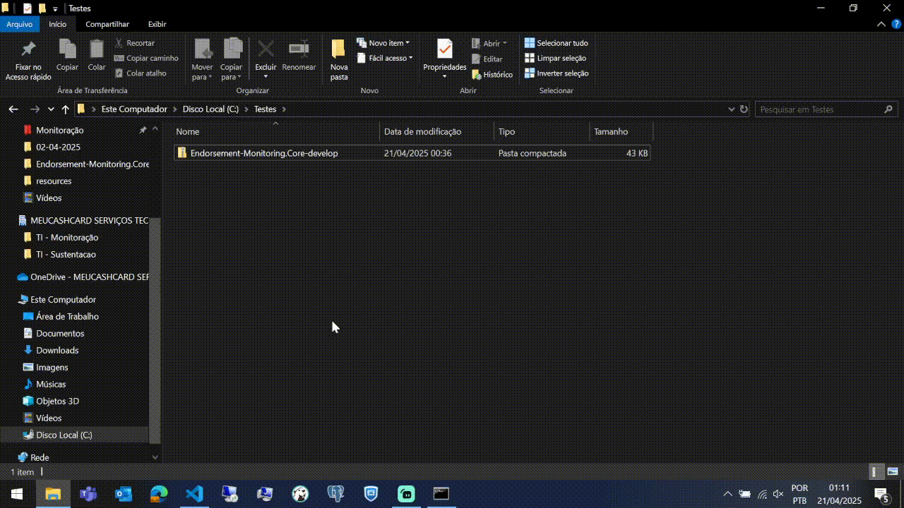
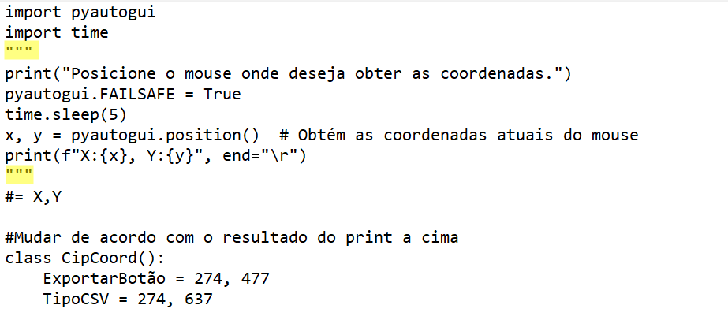
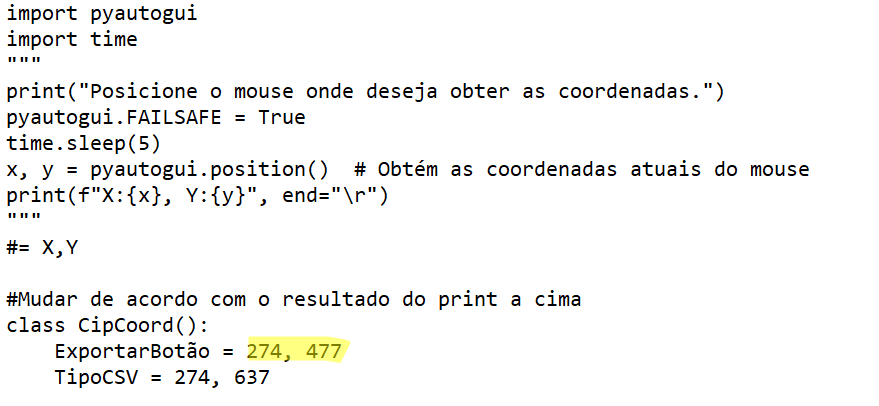
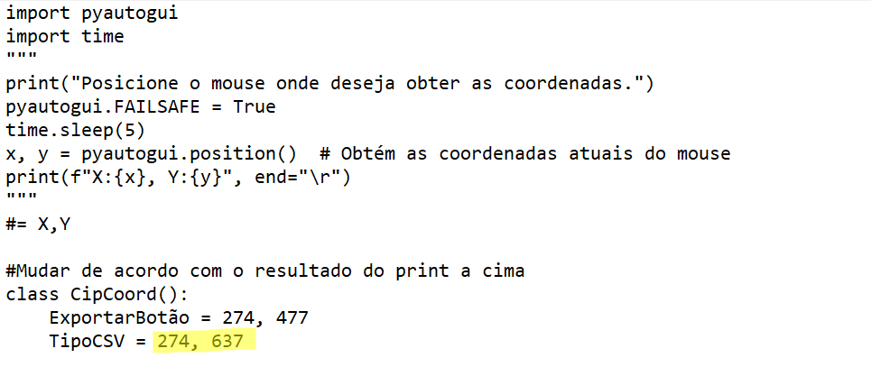

 

  

  <h1 align="center">Endorsement monitoring Import files</h1>

  

    <strong>Projeto de webscraping de relatórios utilizando a bibilioteca Selenium. </strong>

## Tabela de conteúdo

- [Sobre](#Sobre)
- [Criação de ambiente](#Criação-de-ambiente)
- [Instalação e execução](#instalação-e-execução)
- [Estrutura do projeto](#estrutura-do-projeto)
<!--
- [Como contribuir](#Como-contribuir)
- [Contribuidores](#contribuidores)
-->

## Sobre

 Projeto de extração de relatórios utilizando o python para suprir a demanda da tarefa de monitoramento de averbação juntamente ao time de projetos da MeuCashCard, atualmente sob controle da Fernanda Soares Faustino por parte do time de operações e por Felipe Apolinário Pereira pelo time de sustentação.

Esse projeto visa o download de forma rápida e prática dos relatórios para a realização do monnitoramento. Após todos os downloads serem concluídos, é necessário o upload da pasta neste diretório da [S3](https://us-east-2.console.aws.amazon.com/s3/buckets/endorsement-monitoring?region=us-east-2&bucketType=general&prefix=entrada/reports/reports-monitoring/&showversions=false).

---

## Criação de ambiente

 

**Passo a passo:**

**Caso não possua o python baixado, será necessário para a continuação do passo a passo. O download é encontrado [NESTE LINK](https://www.python.org/downloads/) (recomendo utilização de uma versão estável, por exemplo 3.13.0)** 

1. Após o python estar instalado no seu computador, abra o menu iniciar, usando a tecla com o símbolo do windows, digite `CMD` e aperte ENTER.  

2. Para não vazar as credenciais dos logins da processadora, é necessário a criação de um arquivo `.env` na raíz do arquivo usando o mesmo template do arquivo `eg.env` só que mudando os valores para os que correspondem o seu acesso para os sites das processadoras como demonstrado no exemplo a baixo: 
  
para a criação do arquivo `.env` utilize o comando `ECHO text>.env` no cmd aberto no passo '1.' para a criação do mesmo.  **NÃO ESQUECER DE EXCLUIR O "Text" de dentro do arquivo para evitar problemas na execução.** 
---

3. Digite o comando `cd C:\Endorsement-Monitoring.Core` (Ou o caminho correto para aonde o arquivo foi extraido).  

4. Ao mudar o diretório, utilize o comando `py -m  pip install -r requirements.txt`  

5. Abra a pasta da extração do arquivo e vá em `C:\Endorsement-Monitoring.Core\src\processadoras\cip\core` e abra o arquivo `coord.py` com seu bloco de notas e remova as aspas grifadas na imagem a baixo e salve o arquivo: 
  

6. Digite o comando `cd C:\Endorsement-Monitoring.Core\src\processadoras\cip\core` e aperte enter  

7. Vá para o [link da processadora CIP](https://www.portaldoconsignado.org.br/home?37) e, utilizando suas credenciais acesse até a parte do download dos relatórios e,utilizando o mesmo cmd use o comando `py coord.py`.
Esse comando terá um timer de 5 segundos para você colocar o cursor em cima do botão de download.
Exemplo a baixo: 
  
**APÓS OBTER ESSES PRIMEIROS VALORES, COLOQUE OS VALORES DADOS PELO TERMINAL NESTA ÁREA GRIFADA SEGUINDO A ORDEM DE SAIDA  (EX: 'X:284, Y:200' --> 284, 200**): 
  

8. Utilize novamente o comando `py coord.py` só que dessa vez, para a opção de baixar o arquivo CSV.
Exemplo a baixo: 
  
**APÓS OBTER OS SEGUNDOS VALORES, COLOQUE OS VALORES DADOS PELO TERMINAL NESTA ÁREA GRIFADA TAMBÉM SEGUINDO A ORDEM DE SAIDA  (EX: 'X:284, Y:280' --> 284, 280**): 
  

9. Após realizada as mudanças (Caso tenham sido necessárias) nas coordenadas do seu monitor, salve o arquivo.

---

## Instalação e execução

 Após o download dos arquivos e a conclusão da criação de ambiente devida, será necessária novamente a utilização do prompt de comando do windows ou outro de sua preferencia para a execução do script.

 Passo a passo:

**Apenas após terminar o passo a passo de criação de ambiente**
1. Abra o menu iniciar do windows, digite "CMD" e aperte enter  

2. Utilize o comando `cd C:\Endorsement-Monitoring.Core`, aperte enter e após isso, utilize o comando `py __main__.py`  

Caso seja apenas um usuário, sem intenções de mexer no código, o README termina aqui para você, mas caso tenha interesse em contribuir com o projeto, abaixo terá a sessão de estrutura de projeto e logo após a sessão de como contribuir.

---

## Estrutura do projeto

- **Controllers**
  - `cip_controller.py` - Responsável pelas funções executadas nos convênios da processadora CIP  
  - `consigfacil_controller.py` - Responsável pelas funções executadas nos convênios da processadora Consig Facil  
  - `zetra_controller.py` - Responsável pelas funções executadas nos convênios da processadora Zetra   
<!-- 
  - `asban_controller.py`
  - `consiglog_controller.py`
  - `consignet__controller.py`
  - `consigtec_controller.py`
  - `digitalconsig_controller.py`  
  - `neoconsig_controller.py`
  - `serpro_controller.py`
  - `safeconsig_controller.py`
  - `siconsig_controller.py`
  - `sigconsig_controller.py`
-->
- **Arquivos Core:**
  - `browser.py` - utilizado para configurações do webdriver selenium  
  - `date_var.py` - utilizado para variáveis universais de data (Data de saída do arquivo, e padrão da pasta)  
  - `file_manager.py` - utilizado para o manejo dos arquivos baixados e inserção na pasta que será carregada na Amazon S3  
  - `paths.py` - utizado para criação de variáveis dos caminhos desejados para os arquivos que serão manuseados pelo `file_manager.py`  

- **Core Processadoras:**

> **`CIP\CORE:`**
> - `cip_checkbox.py` - Caminhos por XPATH das checkbox necessárias para a geração do arquivo, quaisquer adições ou mudanças de checkbox serão feitas por aqui  
>  - `cip_date_var.py` - Variáveis de data formatadas para inserção sem problemas nos parâmetros da processadora  
> - `coord.py` - Necessária utilização para reconhecer as coordenadas do seu monitor para o botão de extração de relatório da processadora CIP. Caso não seja utilizado de acordo com a recomendação na sessão de **criação de ambiente** os arquivos da CIP provavelmente terão de ser baixados **A MÃO**  
---

> **`CONSIGFACIL\CORE`:**
>- `consigfacil_date_var.py` - Variáveis de data formatadas para inserção sem problemas nos parâmetros da processadora  
  ---

> **`ZETRA\CORE`:**
>- `zetra_date_var.py` - Variáveis de data formatadas para inserção sem problemas nos parâmetros da processadora  
<!--
---

> **`NEOCONSIG\CORE`:**

-->

<!--
## Como contribuir

 
 Crie um fork do projeto e de um `git clone` no seu terminal git.
 Crie sua própria branch e suba um Pull request, ao ser analisado poderá ter as mudanças implementadas na branch main.

 ## Contribuidores 

 

 
 <!-- ADD CONTRIBUIDORES -->